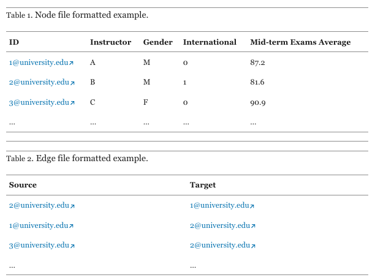
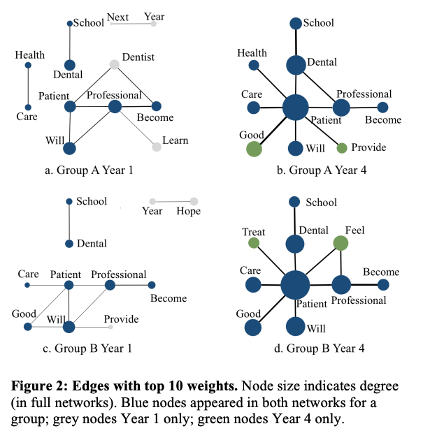

# Social Network Analysis: Theory and Concepts

## Readings

- Scott, J. (2017). Social network analysis (4th edition) (Ch. 1). SAGE Publications.
- Carolan, B. V. (2014). Social network analysis and education: Theory, methods & applications (Ch. 1-2). SAGE Publications.

## Social Network Analysis

Social Network Analysis (SNA) is a research methodology used to study relationships, structures, and interactions within a network of individuals, groups, or entities. It provides both qualitative and quantitative insights into how connections influence behavior, information flow, and social dynamics.

As a *methodology*, SNA offers systemic guidance how to use empirical data to examine relationships, interactions, and network structures. Due to its roots in sociology, SNA reframes research questions to focus on relational patterns rather than isolated individuals. This systemic perspective ensures that researchers consider the broader context of social structures when analyzing phenomena such as collaboration, information flow, or influence. SNA offers guidance on how to define and collect relational data. It provides a systematic set of metrics that help researchers understand network properties at different levels. 

SNA is not purely *quantitative*. SNA offers both quantitative and qualitative approaches to studying relationships, structures, and interactions. While quantitative SNA focuses on measuring and modeling network properties, qualitative SNA emphasizes the interpretation of meanings, contexts, and processes within networks.

Qualitative SNA explores the meaning behind network ties, social roles, and relational dynamics. It often involves interviews, ethnographic observations, and discourse analysis to complement network graphs. There are researchers who conducts mixed-methods social network analysis. For instance, a researcher first maps a teacher collaboration network in a school using SNA. After identifying key 'influencers' (high degree centrality) and isolated teachers, they conduct qualitative interviews to explore: Why some teachers are less connected? How informal conversations impact professional development? 

## Examples of SNA and network analysis in education

As you start to define your course project, please spend time to search example use of network analysis in areas you are interested in. 

To illustrate possibilities, below are three distinct examples of using SNA and word networks. As you seek to define your own project, please spend time to think about the problem you try to solve, specific questions you'd like to answer, and data that will be needed to answer these questions. Doing so will prepare you for the upcoming project pitch. 

### Integration in emerging social networks explains academic failure and success {cite}`stadtfeld2019integration`

- Setting: Student success in college
- Problem/Questions: how social networks emerge between previously unacquainted students and how integration in these networks explains academic success
- Data: Three waves of surveys 
- Network construction: Student networks of multiple types of ties
- Analysis: 1) Descriptive network analysis; 2) bivariate correlations of social integration with GPA; 3) Linear regression models on GPA

### “Connecting online”: The structure and content of students' asynchronous online networks in a blended engineering class {cite}`lee2021connecting`

- Setting: Student interactions in online forums
- Problem/Questions: What patterns of engagement are observed on the forum? How is engagement on forum related to academic performance?
- Data: Interaction data on the online forum, transformed to a node list and an edge list
- Network construction: Student networks of online interactions
- Analysis: 1) Network-level descriptive analysis; 2) node degree centrality; 3) content analysis on discussion content; 4) regression analysis on degree centrality and course performance

### Top Concept Networks of Professional Education Reflections {cite}`wise2019top`

- Setting: A four-year dental education program
- Problem/Questions: How to capture a shift to a more integrated, patient-centered conceptualization of a health profession?
- Data: reflective statements by students from the program
- Network construction: Top concept networks, constructed by extracting key concepts, with a tie represents co-occurrence in a sentence
- Analysis: 1) Identify top concepts, 2) Identify top connections between concepts, 3) Examine changes over four years.

